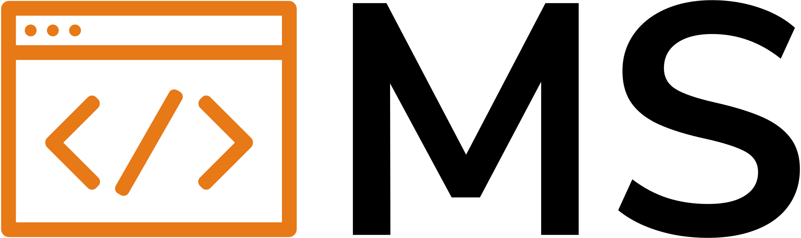
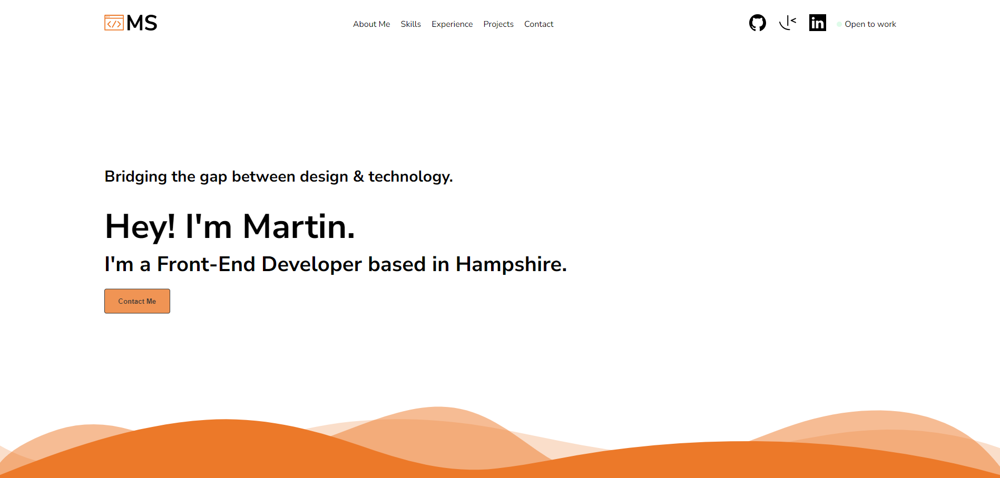

<div align="center">
<h1>Martin Shelley Portfolio site - <a href="https://martinshelley.com">https://martinshelley.com</h1>
</div>



## Project setup

Please follow the following steps to get this portfolio running on your machine:

- Install Vue CLI

```
npm install -g @vue/cli
```

- Install correct version of Node

nvm install node-version-number e.g.

```
nvm install 14.20.0
```

- Install dependencies

```
npm install
```

- Complie and run on development

```
npm run serve
```
